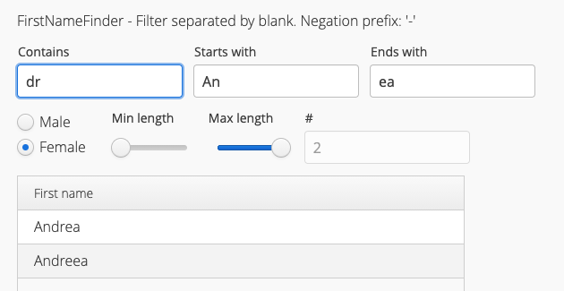

# First name finder
If you try to find a name for your unborn for example - here you have an easy tool.
It gives you plenty of filter possibilities.

Just use minus "-" to negate.

Use blank " " to filter multiple.

## Name data base is missing in the repo
I was not yet able to get the permission to publish the name database from heise.de.

But there is a project on github that already published it:
https://github.com/cstuder/genderReader/blob/master/gender.c/nam_dict.txt

Just put it in the resources folder.

You can also use your own and adjust FirstNameModelBuilder to read your own name database.
Then you would also have to adjust the file name in the application.properties.

## Run the application
Start FirstNameFinderApplication
Open in your browser: localhost:8080/ui

## Background
First name finder was implemented between christmas and new year 2017/2018 to help to 
find a name for our child.